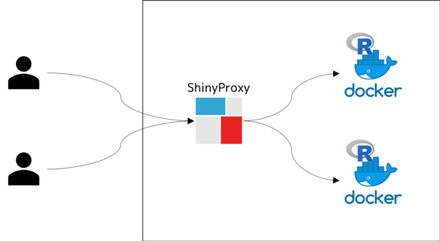
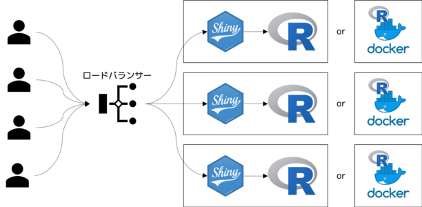

```{r setup, include=FALSE}
library(magrittr)
library(dplyr)
library(shinyjs)
library(ggplot2)
library(plotly)
library(DiagrammeR)
library(httr)

knitr::opts_chunk$set(echo = FALSE, comment = NA)
theme_set(theme_bw())

shorten_url <- function(long_url, endpoint = 'https://api-ssl.bitly.com/v4/shorten', ..., access_token) {
   if (missing(access_token) || is.null(access_token)) {
      return(long_url)
   }

   payload <- list('long_url' = long_url)
   response <- POST(endpoint, body = payload, encode = 'json', add_headers('Authorization' = paste('Bearer', access_token)))
   if (status_code(response) == 200L || status_code(response) == 201L) {
     short_url <- content(response)$link
     urltools::scheme(short_url) <- 'https'
     short_url
   } else {
     long_url
   }
}

session_id <- config::get('session_id')
client_url <- config::get('respondent_app_url') %>% 
  urltools::param_set('session_id', session_id) %>% 
  shorten_url(access_token = config::get('bitly_access_token'))  # if not set, nothing occurs
client_url_qr <- qrencoder::qrencode_raster(client_url)

table_presenter <- config::get('table_presenter') %>% aws.dynamodb::get_table()
table_respondent <- config::get('table_respondent') %>% aws.dynamodb::get_table()

#' 現在のページを DynamoDB に登録する。
set_current_page <- function(session_id, page) {
  # 空文字は挿入できないため適当な文字列を割り当てる。
  if (is.null(page)) {
    page <- '__undefined'
  }
  key <- list(
    'SessionId' = list('S' = session_id)
  )
  request_body <- list(
    'TableName' = table_presenter$TableName,
    'Key' = key,
    'ReturnValues' = 'NONE', 
    'UpdateExpression' = 'SET PageId = :val',
    'ExpressionAttributeValues' = list(":val" = list('S' = as.character(page)))
  )
  aws.dynamodb::dynamoHTTP(verb = 'POST', body = request_body, target = 'DynamoDB_20120810.UpdateItem')
  invisible()
}

#' 現在のユーザー回答を取得する。
get_user_response <- function(session_id, question_id) {
  condition_expr <- 'SessionId = :val'
  values <- list(":val" = list('S' = session_id))
  projection <- c('UserId', question_id)
  request_body <- list(
    'TableName' = table_respondent$TableName,
    'IndexName' = 'SessionId-index',
    'KeyConditionExpression' = condition_expr,
    'ExpressionAttributeValues' = values,
    'ProjectionExpression' = paste(projection, collapse = ',')
  )
  response <- aws.dynamodb::dynamoHTTP(verb = 'POST', body = request_body, target = 'DynamoDB_20120810.Query')
  m <- matrix(NA_character_, nrow = 0L, ncol = length(projection), dimnames = list(character(0L), projection))
  answer <- data.frame(m, stringsAsFactors = FALSE)
  for (item in response$Items) {
    keys <- names(item)
    values <- unlist(lapply(item, unlist))
    names(values) <- keys
    answer <- bind_rows(answer, values)
  }
  answer
}

refresh_interval <- 500
```

```{r}
useShinyjs(rmd = TRUE)
includeScript('presentation.js')

observe({
  current_page <- input$page_id
  set_current_page(session_id, current_page)
})
```

## 自己紹介

- kos59125

```{r realname, echo=TRUE}
# 本名を復元
realname <- chartr('1-9', 'a-i', 'kos59125')
cat(realname)
```

- 株式会社コネクトデータ代表取締役
    - 最近はデータサイエンティストをサポートするウェブサービスの開発をメインにやっています（年内リリース目標）
  
## 今日の内容

話すこと

- アプリケーションって何だろう
- Shiny を利用したアプリケーションの設計事例

話さないこと

- Shiny の仕組み

## アンケート

## と、その前に

プレゼンテーション中にとるアンケートの結果って、正確に知りたくないですか？

## 改めてアンケート {#shiny-experience}

Shiny アプリケーションの経験はどの程度ですか？（スマートフォンまたは PC からご回答ください）

<div class="row">

<div class="col-md-8">

```{r}
shiny_experience <- reactive({
  invalidateLater(refresh_interval)
  get_user_response(session_id, 'ShinyExperience')
})

renderPlotly({
  experience <- shiny_experience()
  
  result <- experience %>% 
    filter(!is.na(ShinyExperience)) %>% 
    group_by(ShinyExperience) %>% 
    summarise(count = n()) %>% 
    mutate(ShinyExperience = factor(ShinyExperience, levels = c('初心者', 'そこそこ', '得意')))
  g <- ggplot(result, aes(x = ShinyExperience, y = count)) +
    geom_bar(aes(fill = ShinyExperience), stat = 'identity', position = 'stack', width = 0.2) +
    labs(y = '回答件数') +
    guides(fill = guide_legend(title = '経験')) +
    theme(
      axis.ticks.x = element_blank(),
      axis.title.x = element_blank()
    )
  ggplotly(g, tooltip = NA) %>% 
    plotly::layout(paper_bgcolor = 'rgba(0,0,0,0)', plot_bgcolor = 'rgba(0,0,0,0)') %>% 
    plotly::config(locale = 'ja', displayModeBar = FALSE)
})
```

</div>

<div class="col-md-4">

回答 URL: `r client_url`

<figure>
<span>
```{r, out.width='90%'}
par(mar = c(0, 0, 0, 0))
raster::image(client_url_qr, col = c('white', 'black'), asp = 1, axes = FALSE, xlab = NULL, ylab = NULL)
```
</span>
</figure>

</div>

</div>

## 連打！ {#hits-counter}

お手元のボタンを連打してください。

<div class="row">

<div class="col-md-8">

```{r}
counter <- reactive({
  invalidateLater(refresh_interval)
  get_user_response(session_id, 'HitsCounter')
})

renderPlotly({
  hits <- counter()

  result <- hits %>% 
    filter(!is.na(HitsCounter)) %>% 
    mutate(HitsCounter = as.numeric(HitsCounter))

  total_hits <- sum(result$HitsCounter)
  # 誰もヒットしていない場合は -Inf 
  max_hits <- suppressWarnings(if_else(max(result$HitsCounter) < 0, 0, max(result$HitsCounter)))

  g <- ggplot(result, aes(x = UserId, y = HitsCounter, group = UserId)) +
    geom_bar(stat = 'identity', width = 0.2) +
    ggtitle(glue::glue('合計: {total_hits}、 最大: {max_hits}')) +
    labs(x = '参加者', y = '連打数') +
    theme(
      axis.ticks.x = element_blank(),
      axis.text.x = element_blank()
    )
  ggplotly(g, tooltip = NA) %>% 
    plotly::layout(paper_bgcolor = 'rgba(0,0,0,0)', plot_bgcolor = 'rgba(0,0,0,0)') %>% 
    plotly::config(locale = 'ja', displayModeBar = FALSE)
})
```

</div>

<div class="col-md-4">

回答 URL: `r client_url`

<figure>
<span>
```{r, out.width='90%'}
par(mar = c(0, 0, 0, 0))
raster::image(client_url_qr, col = c('white', 'black'), asp = 1, axes = FALSE, xlab = NULL, ylab = NULL)
```
</span>
</figure>

</div>

</div>

## どうやってる？

- RMarkdown は Shiny アプリケーションを動かすことができる
- このプレゼンテーションは Shiny アプリケーション

```{r}
this_rmd <- readLines('main.Rmd')
header <- this_rmd %>% equals('---') %>% which() %>% head(2)
cat(this_rmd[header[1]:header[2]], sep = '\n')
```

## システム構成

- Shiny アプリケーション 2 つ
    - スライド
    - 回答
- DB を介して現在のページ番号および回答データをやりとり

```{r}
architecture <- '
graph LR
  D(DB)
  P(スライド Shiny)
  A(回答 Shiny)
  P -->|ページ設定| D
  P -->|データ取得| D
  A -->|ページ取得| D
  A -->|回答送信| D
'
architecture %>% mermaid()
```

## アプリケーションとは

- 何らかの業務目的を達成するために作られたプログラム
- 通常は何らかの入力があり、それに応じた処理を行い、処理の結果を出力
- 入力や出力は、データ

つまり、アプリケーションはデータを受け取って何かをした結果のデータを得るためのものと考えることができる。

## Shiny

Shiny を用いることでデータやデータ分析をインタラクティブにユーザーに操作させるアプリケーションを開発することができる。

> Take a fresh, interactive approach to telling your data story with Shiny. Let users interact with your data and your analysis.
>
> Shiny is an R package that makes it easy to build interactive web apps straight from R.
> 
> https://shiny.rstudio.com/ より

<figure>
```{r}
'
graph LR
  U(ユーザー)
  S(Shiny)
  D(データ)
  U --> S
  S --> U
  S --> D
' %>% 
  mermaid()
```
</figure>

## データはどこで生まれるのか？

Shiny の操作対象となるデータは、他のアプリケーションによって生じている。

```{r}
'
graph LR
  U(ユーザー)
  A(アプリケーション)
  D(データ)
  U --> A
  A --> D
' %>% 
  mermaid()
```

## Shiny をデータソースとする

Shiny アプリケーションはアプリケーションなので、他のアプリケーションのデータソースとなりうる。

```{r}
'
graph LR
  U(ユーザー)
  S(Shiny)
  D(データ)
  U --> S
  S --> D
' %>% 
  mermaid()
```

## データの持ち回し

- 通常 Shiny は入力と出力が同一画面で実現される
- ユーザーの入力を他のアプリケーションと連携するためには、入力をどこかに保存しておかなければならない
    - データベースの利用

## データとは？

- 質問に対するユーザーの回答
- 発表者の質問に対する回答方法

## 気にするポイント

- アクセス数
  - セミナーで話すため受講者は数十人程度
  - ほぼ同時に回答が来るためリクエストを捌ききる必要がある

## Shiny の同時アクセス問題

オープンソース版の Shiny Server は R の同時複数セッションをサポートしていない。

<figure>

</figure>

## 同時アクセス対処（1） Shiny Server Pro

RStudio 社が提供する Shiny Server Pro や RStudio Connect を用いると、複数の R セッション利用して Shiny アプリケーションを共有できる（らしい）。

<figure>

</figure>

## 同時アクセス対処（2） ShinyProxy

Open Analytics 社が提供する ShinyProxy を用いると、 Shiny アプリケーションの Docker コンテナを複数立ち上げることができる。

<figure>

</figure>

## 同時アクセス対処（3） ロードバランサー

ロードバランサーのバックエンドに Shiny アプリケーションを配置することで、複数の R セッションを同時に使い回す。

- Nginx や AWS の ALB、 Kubernetes など。
- 前述の方法と組み合わせることもできる。

<figure>

</figure>

## Shiny の同時アクセスの解決まとめ

<table class="table-matrix">
<tr>
  <th>方法</th>
  <th>メリット</th>
  <th>デメリット</th>
</tr>
<tr>
  <th>Shiny Server Pro</th>
  <td>デプロイが簡単</td>
  <td>有償</td>
</tr>
<tr>
  <th>ShinyProxy</th>
  <td>デプロイが簡単</td>
  <td>Docker イメージの準備が重い</td>
</tr>
<tr>
  <th>ロードバランサー</th>
  <td>自由度が高い</td>
  <td>インフラスキルが必要</td>
</tr>
</table>

## データの同時入出力問題

Shiny に同時にアクセスされると、その背後にあるデータベースに負荷がかかる。

- 書き込み負荷
- 読み込み負荷

データベースの負荷を軽減するような工夫を検討する。

- データベースの選択や設計
- クエリーの単純化と集計処理のクライアント（Shiny）側への委譲

## 処理時間の問題

アプリケーション、データベースにおける集計処理や、結果の受け渡し通信など、時間的な課題が発生しうる。

特にシステム構成が複雑な場合は、待ち時間が発生しないような仕組みを利用することを検討する。

## 設計はトレードオフ

アプリケーション、データベース、ネットワークといった個々のシステム構成要素にはパフォーマンス上のトレードオフの関係があり、同時に最適化するのは難しい。

アプリケーションの性質によって適切に設計し、うまく品質をコントロールする必要がある。

## このスライドのアーキテクチャー

- DynamoDB
    - 読み込みは発表者のみに対して、書き込みは最大聴講者数
    - 書き込みは同時的に発生する
- EC2 + ShinyProxy
    - 試行錯誤しながらの導入が簡単
    - ALB で HTTPS が容易に実現できる

上記の組み合わせが常に最適というわけではないため、自分のケースに合わせて設計しよう。

## 苦労した話など

- DynamoDB
    - DynamoDB を操作するための `cloudyr/aws.dynamodb` というパッケージがあるけど一部の関数しか動かなかった
    - 結局 REST API ドキュメントとにらめっこしながら必要なものを実装することに
- Docker イメージの準備
    - （R の）必要なパッケージが固まるまで依存ライブラリーのインストールとパッケージのビルドで時間かかりすぎ
- GCP Cloud Run
    - Docker イメージを用意するだけで簡単にオートスケールが実現でき、インスタンスあたりのリクエスト数も調整できるから簡単かと思ったら websocket に対応していない罠にはまり没案に
    - 設定ファイルを特に書かずにコマンド一つで Docker イメージがクラウド上でビルドできるのは便利だった
- 会場
    - （Docker のビルドが時間がかかってつらいので）スライドをローカルにしていたら会場のネットワークから DynamoDB や Bitly にアクセスできなかった 

## さいごに {#last-questionnaire}

今回の発表に対する感想をお聞かせください。

<div class="row">

<div class="col-md-8">

```{r}
presentation_difficulty <- reactive({
  invalidateLater(refresh_interval)
  get_user_response(session_id, c('ShinyExperience', 'Difficulty'))
})

renderPlotly({
  difficulty <- presentation_difficulty()
  
  result <- difficulty %>% 
    filter(!is.na(Difficulty)) %>% 
    group_by(ShinyExperience, Difficulty) %>% 
    summarise(count = n()) %>% 
    ungroup() %>% 
    mutate(
      ShinyExperience = factor(ShinyExperience, levels = c('初心者', 'そこそこ', '得意')),
      Difficulty = factor(Difficulty, levels = c('簡単', 'ちょうどよい', '難しい'))
    )
  g <- ggplot(result, aes(x = Difficulty, y = ShinyExperience)) +
    geom_tile(aes(fill = count), colour = "white") +
    geom_text(aes(label = as.character(count)), vjust = 1) +
    scale_colour_gradient(low = "white", high = "black") +
    labs(x = '難易度', y = '経験')
  ggplotly(g, tooltip = NA) %>% 
    plotly::layout(paper_bgcolor = 'rgba(0,0,0,0)', plot_bgcolor = 'rgba(0,0,0,0)') %>% 
    plotly::config(locale = 'ja', displayModeBar = FALSE)
})
```

</div>

<div class="col-md-4">

回答 URL: `r client_url`

<figure>
<span>
```{r, out.width='90%'}
par(mar = c(0, 0, 0, 0))
raster::image(client_url_qr, col = c('white', 'black'), asp = 1, axes = FALSE, xlab = NULL, ylab = NULL)
```
</span>
</figure>

</div>

</div>
